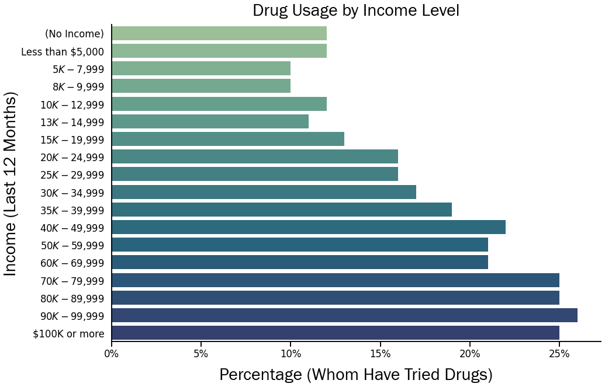
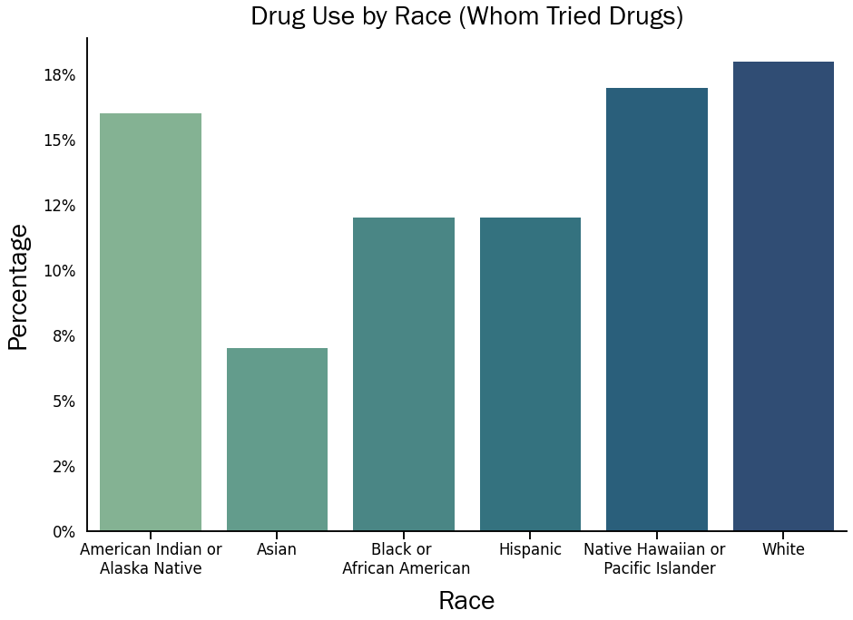
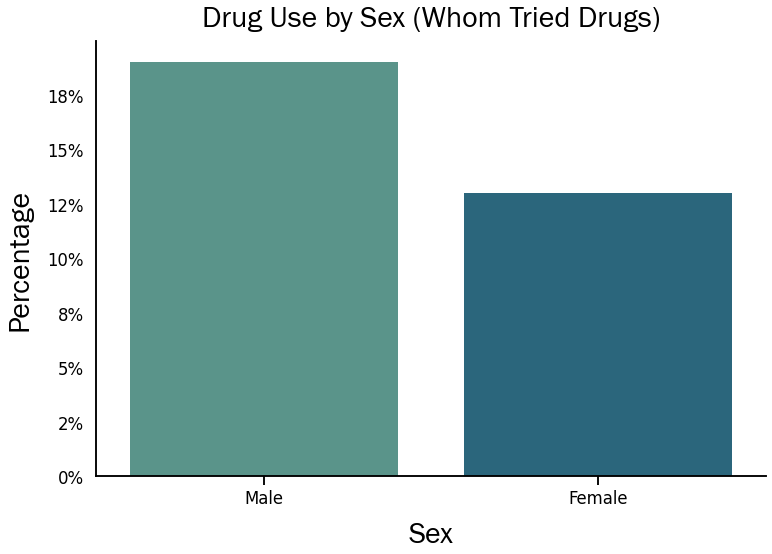

## Goal
The goal is to observe the percentage of admitted drug use categorized by income levels, Ethicity, and sex.  

## Dataset
The dataset used is the NESARC (National Epidemiologic Survey on Alcohol and Related Symptoms) from 2004 which asked if participants, 18 and older, if they partook in the use of a list of specific drugs. 

## Code
[Drug Use Jupyter Notebook](Drug_Use_Notebook.ipynb)

## Visualizations

The chart above shows the relationship between the percentage of people who have tried at least one drug categorzied by their personal income levels. The lowest percentage of those who have tried illicit substances were those whose personal income fell between $5,000 and $10,000. The highest percentage of users were the individuals with a personal income of $90,000 to $99,000. This chart also indicates that as the personal income of the individual increases so does the percentage of those who have tried at least one drug.

This chart displays the percentage of those who have tried at least one illicit substance identified by race.  Those who identified as Asian had the lowest percentage of experimentation, with less than 8% having tried drugs. The sample population who identified as white had the highest percentage with over 18% sampling at least one drug. 

Finally, this chart shows us the percentage of individuals who have sampled at least one drug according to their sex. Males had a higher percentage with 18% having tried drugs at least once, compared to only 13% of females.

 

#### [Back to Main](https://github.com/bboulware7/Projects)

