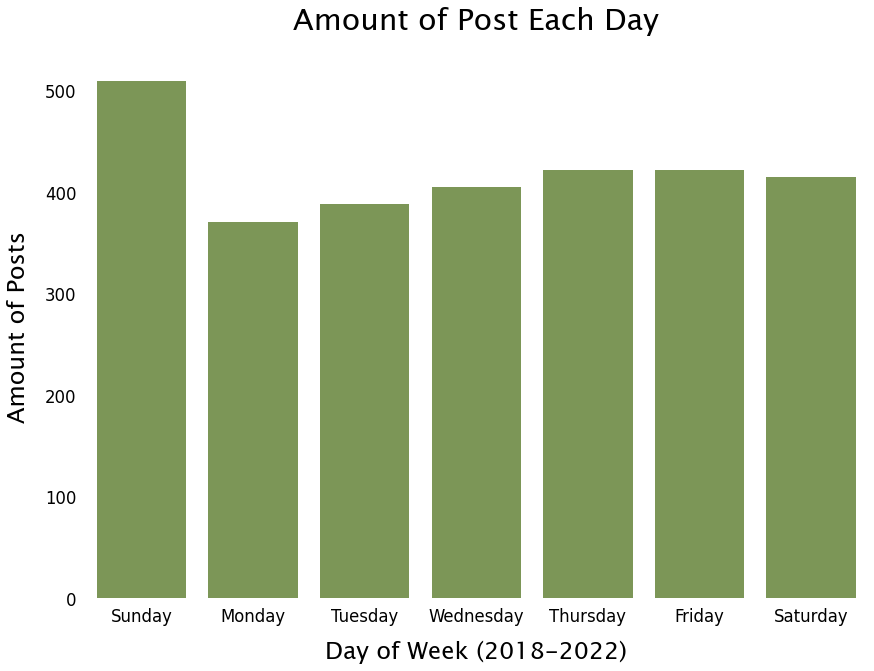
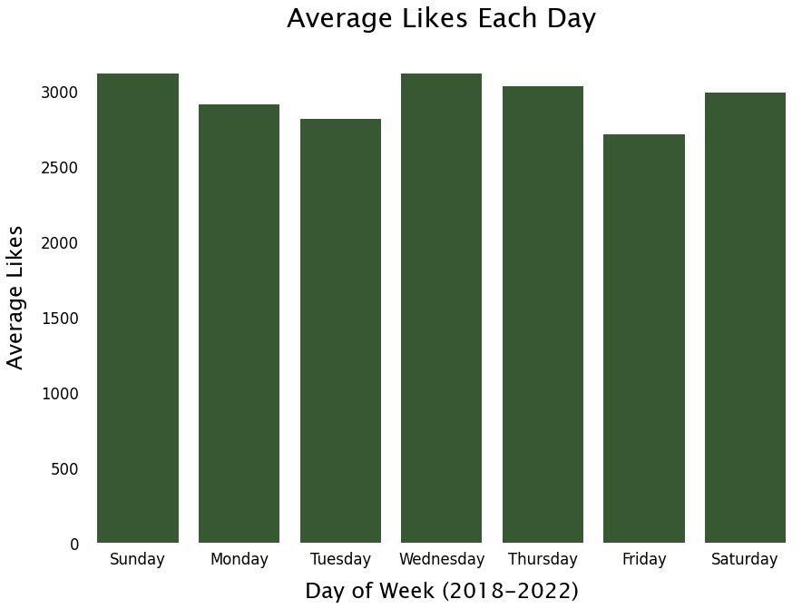
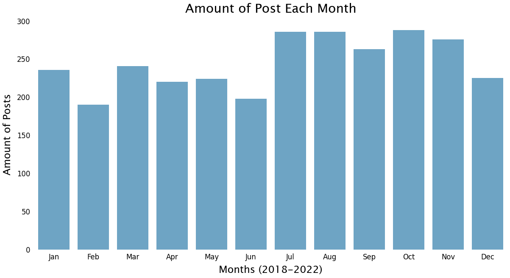
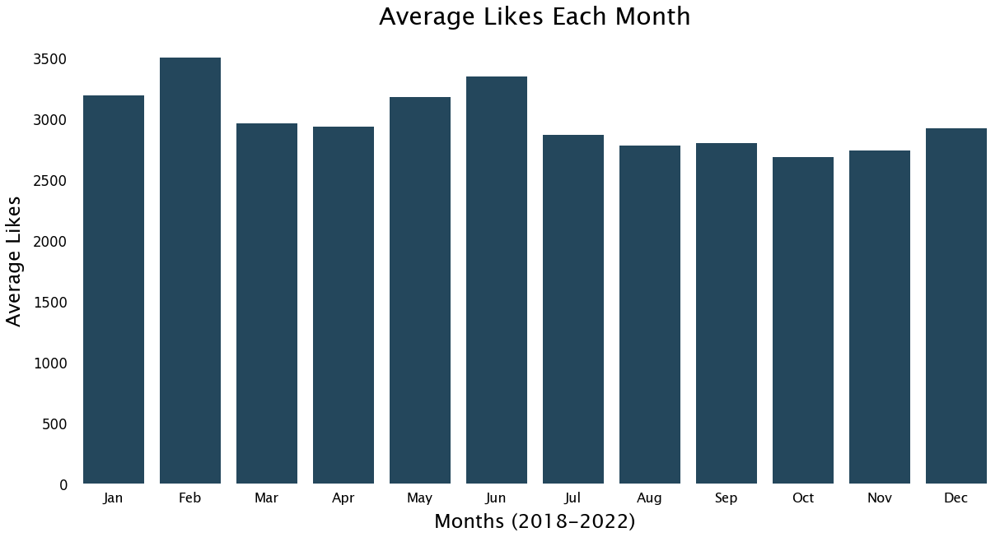
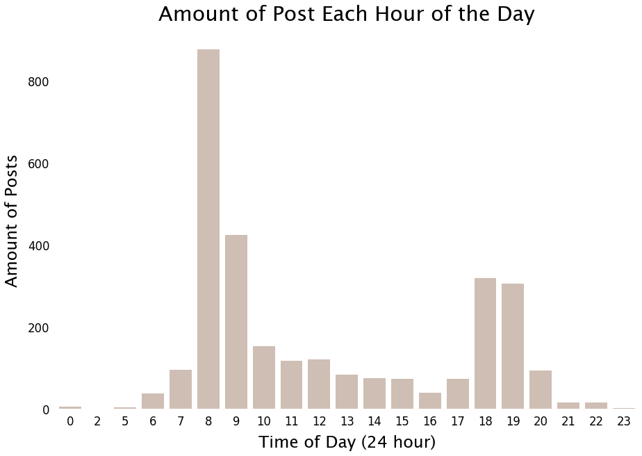
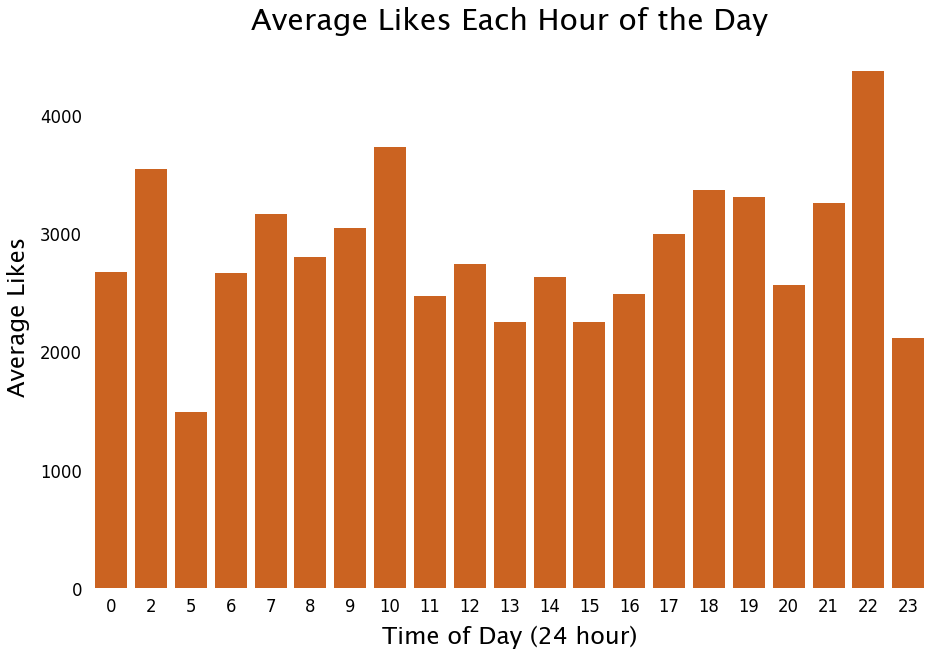
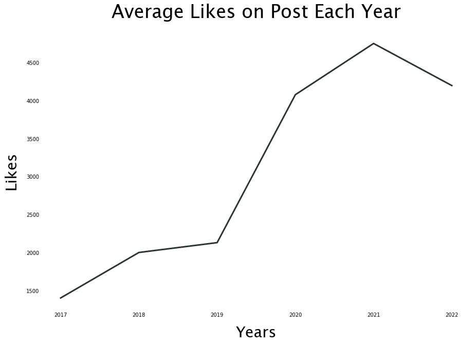

### Goal:
The goal for this project was to identify any trends in the data for a popular social media website, including top performing day of week, time of day, and month of year. Specifics like the impact the length of the caption has on the amount of likes on a post were also explored. 

To obtain the data I built a python script to gather the information from the web. This program includes a GUI to enter in a login and password for the social media website, and gives the user the ability to search a user or hashtag followed by the amount of posts the user wants to scrape.  It will compile a csv of timestamp, post, likes, captions, and hashtags. The CSV saves under the searched word followed by the amount of post scraped, i.e. C:\user\searched_amount.csv.

### [Selenium Bot Code](Selenium_Bot.py)

Now that we have gathered the data needed we will open them using Jupyter Notebook. 

### [Data Wrangling Code](Social_Media_Notebook.ipynb)

After cleaning and exploring our data.

# Plotting the data according to the day of the week   
 
 
 
The two charts above represent the average amount of likes and the total amount of likes for each day of the week. This data shows all posts for the user between 2018 and 2022. Sundays have the most with 510 posts, as well as the highest average amount of likes per post with 3,118 Likes. The day of the week with the fewest amount of posts is Monday with 371 posts, but Friday recieved the fewest amount of average likes with 2,715 per post.

# Plotting the data according to months of the year  
 
 
 
In these charts, we look at the same data categorzied by month of the year. October has the most amount of posts with 288, followed by July with 286, and August with 286. Feburary has the least amount of posts with 190.  The chart on the right shows Feburary having the highest amount of likes with an average of 3,502 likes per post. The lowest amount of Likes per post is October with an average of 2,686 Likes per post.

# Plotting the data according to time of day using a 24 hour cycle  
 
 
 
Finally, the last two charts represent the data categorized by the time of day. If the time is absent from the chart, it indicates that there were no observations made during those times. Looking at the chart on the right, 8:00 (8AM) has the most amount of posts with 878 being posted at that time. The least amount of posts happen at 2:00 (2AM). One post occured at that time. The chart on the right shows the average amount of likes recieved for those posts. The largest amount of likes occurs at 22:00(10PM) with an average of 4,377 likes. 5:00 (5AM) has the fewest amount with an average of 1,486 likes.
 
 
 
 

This last chart shows growth of average likes from 2017 to 2022. The largest growth in the chart happens between 2019 and 2020 where the average likes nearly double from 2,130 likes to 4,077 likes in 2020.

 

#### [Back to Main](https://github.com/bboulware7/Projects)
