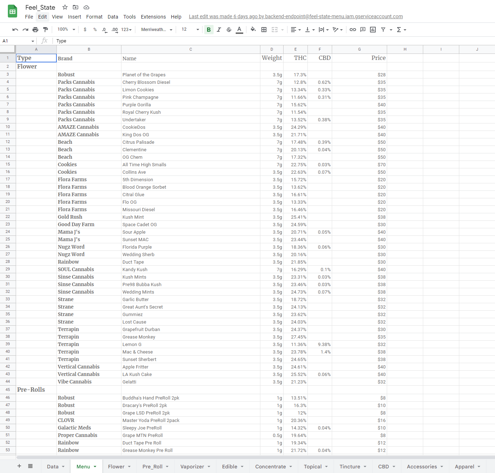

### Feel State Menu 

Currently, the only way for this small business to display what is available for sale in store is on their 3rd party website. This small business would like to have something printable, and eventually something to display on their tablets in store for customers to browse while they wait.  To solve this problem, I created a python program to ping the retail website endpoint, then cleaned and transformed the json response into Google Sheets using the Google Sheets API.  This program also needed to do this every 15 mins to keep the Google sheet up to date. The small business owner would like the ability to print the items for sale by category, but also have the house brands appear on top of within their category then alphabetically. The way I chose to automate this program was with task scheduler on the owners office computer. 

Here is the python program file  
[Python File](menu_code.py "Python File")
 
 
This is the final product that the owner used to add seasonal formatting. The data is imported and the rest of the sheets are set up using formulas from Google sheets. 

 
 

## NEXT....
Currently I am creating a landing page that will be only available on the stores private wifi. This will be shared on the store tablets for customers to consume digitally. 

