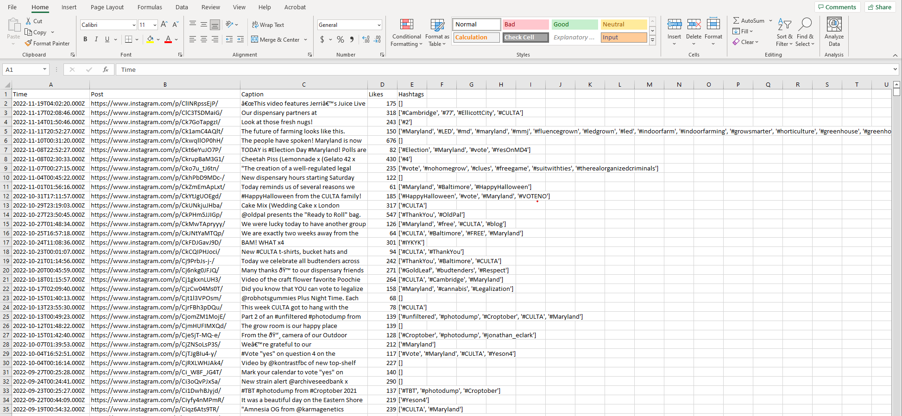
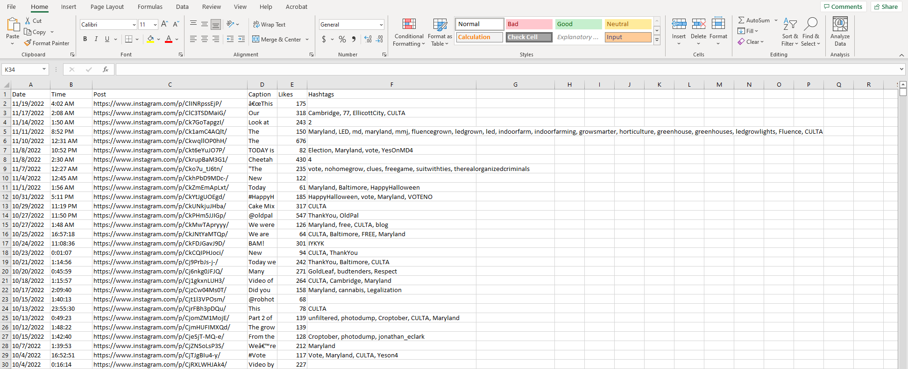
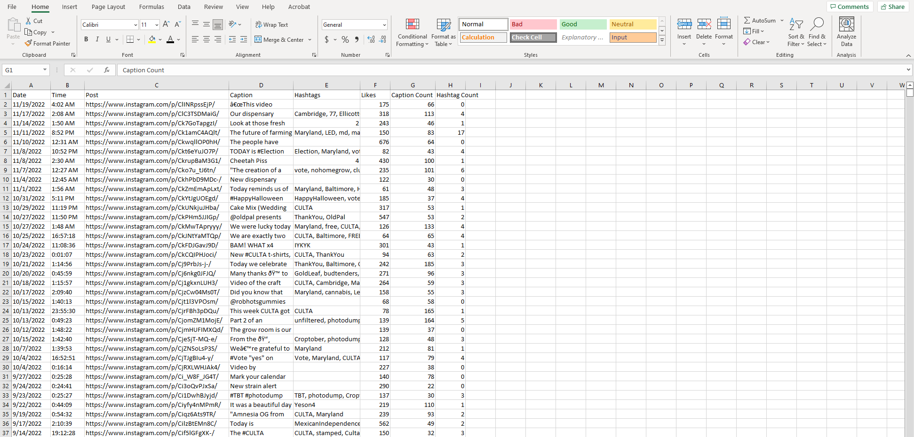
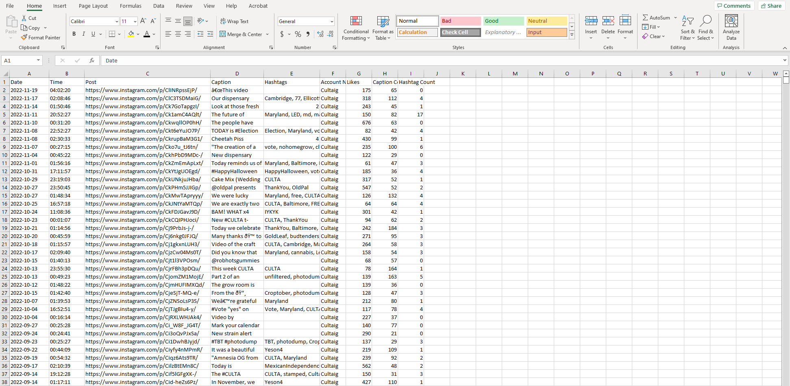

# Cleaning social media data with Excel.

After scraping the data with our [python program](Scrapper.py). I split the data into two tables one for accounts with larger followings and those the owner of the small business chose. The second table is consists of data from local competition as well as the store owners account. Below we have the table for local competition.

First, I chose to remove duplicates from our data.  Next, I cleaned the string in several columns, for example removing all the brackets and pound symbol from the hasthags column. Instagram gives users the option to hide the amount of likes recieved, when this option is chosen the post will show accounts that have liked this post instead. This was an issue for many of the local account post. When this happens the program scraps the account name instead of the like amount. In this situation I have chose to remove those entries from the data. 

Then created a word count column for both the caption and hashtags using =LEN(TRIM(D2))-LEN(SUBSTITUTE(TRIM(D2)," ",""))+1 for caption count and =IF(ISBLANK(F2),"0",LEN(TRIM(F2))-LEN(SUBSTITUTE(TRIM(F2),",",""))+1) for hashtag count. These columns will be used to test the correlation between the amount of likes a post recieves and the lengths of caption or amount of hastags. 

Lastly I want to remove any values in the likes column that were empty and add a column for account name, percentile, and day of week. These columns will be used in pivot tables. This was due to Instagram choosing to display accounts who liked the post and not how many likes the post recieved.

The data set consist of 3926 rows and 9 columns. I repeat this same process for the larger accounts table. The second data set consist of 2509 rows and 9 columns. This will be imported into Google Data Studio and Power Bi for analysis and visualizations 

Once the data has been clean. I created some pivot tables to visualize the data more clearly. Once table shows the data grouped by day of week and time of day. These tables shows the percentage of post reached each percentile mark. For example we see taht 