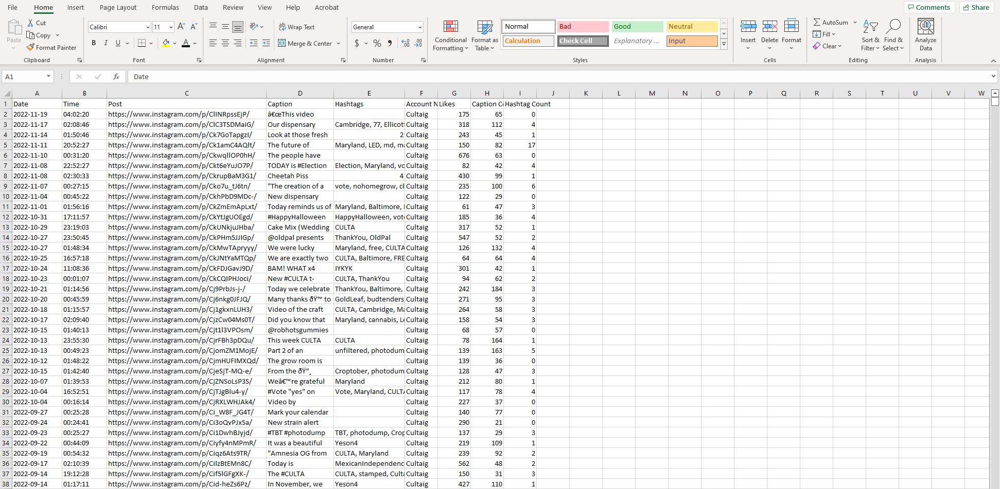

# Cleaning social media data with Excel.

After scraping the data [Python Scraper](Scraper.py). I split the data into two dataset. The first dataset is the data for accounts with larger followings (>10,000 followers). The second dataset was for local competition along with smaller accounts requested by the business owner. Below is the local accounts excel wooksheet, which consist of 3676 rows and 11 columns. [Cleaned File](instagram_data/local.xlsx)

First, I chose to remove duplicates from the data.  Next, I cleaned the content in several columns, i.e., removing all the brackets and pound symbols from the hasthags column. Instagram gives users the option to hide the amount of likes recieved, in cases like this, the post will show accounts that have liked this post instead. This was an issue for many of the local account post. Because of this we have some values in Likes that are not numeric. In this situation I have chose to remove those entries from the data. 

Then I created a word count column for both the captions and hashtags using =LEN(TRIM(D2))-LEN(SUBSTITUTE(TRIM(D2)," ",""))+1 for caption count and =IF(ISBLANK(F2),"0",LEN(TRIM(F2))-LEN(SUBSTITUTE(TRIM(F2),",",""))+1) for hashtag count. These columns will be used to test the correlation between the amount of likes a post recieves to the lengths of caption or amount of hastags. 

Lastly I removed any values in the likes column that were blank and add a column for account name, percentile, and day of week. These columns will be used in further analysis.

I repeat this same process for the larger accounts table. The second data set consist of 2509 rows and 9 columns. This will be imported into Google Data Studio and Power Bi for analysis and visualizations. Below is the finished excel spreedsheet.

