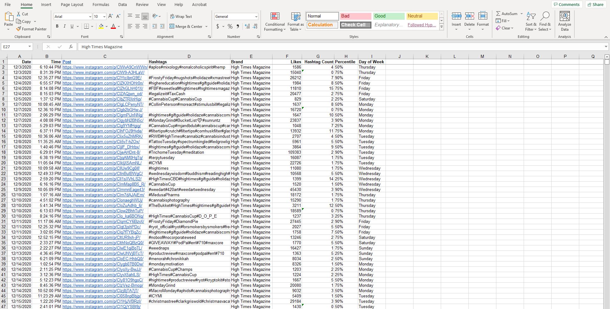
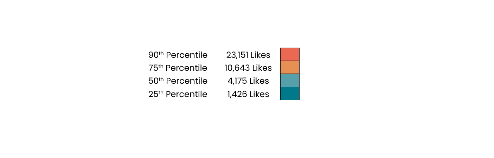
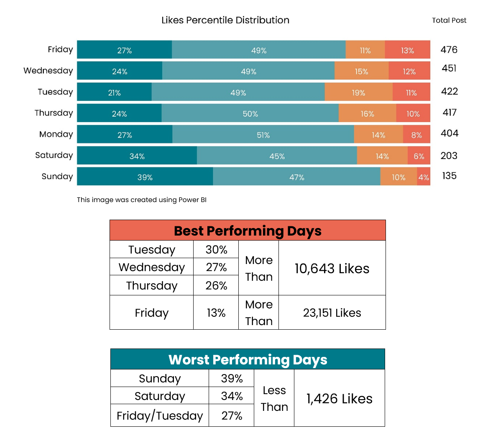
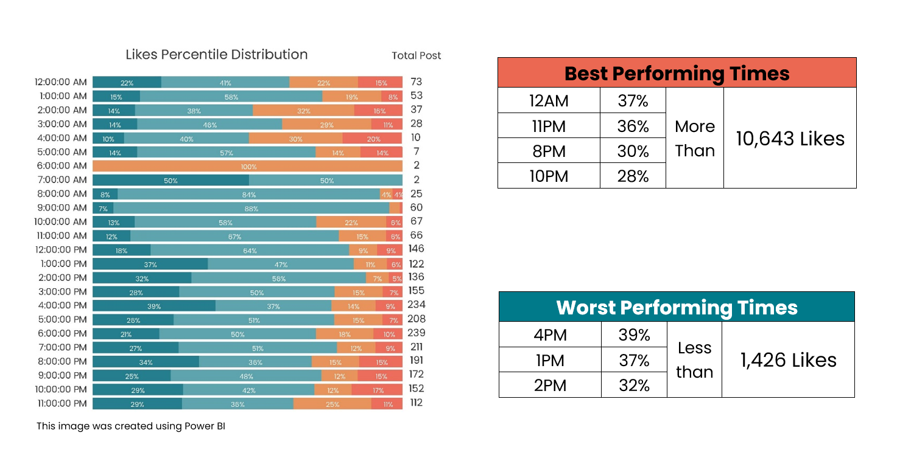
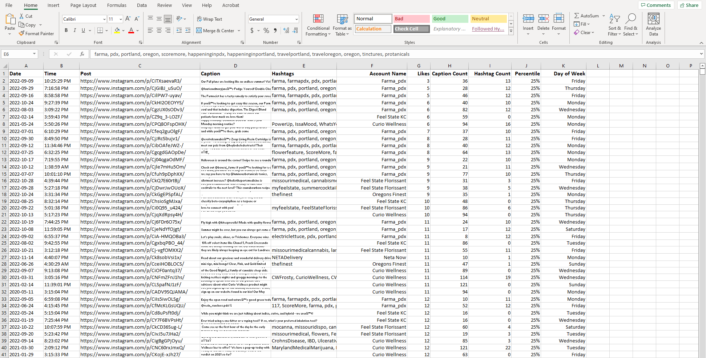
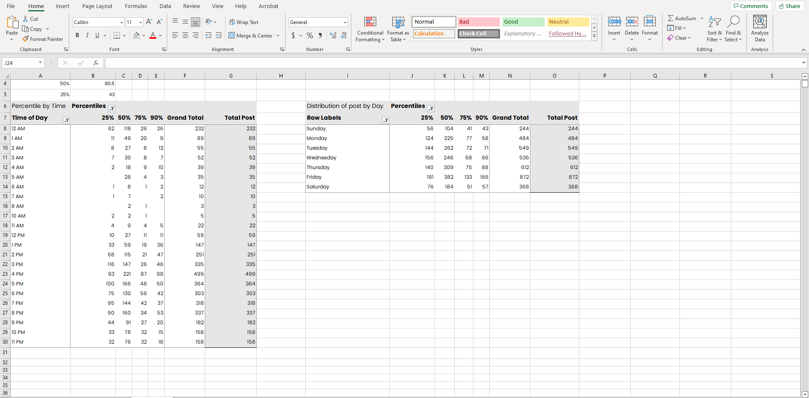
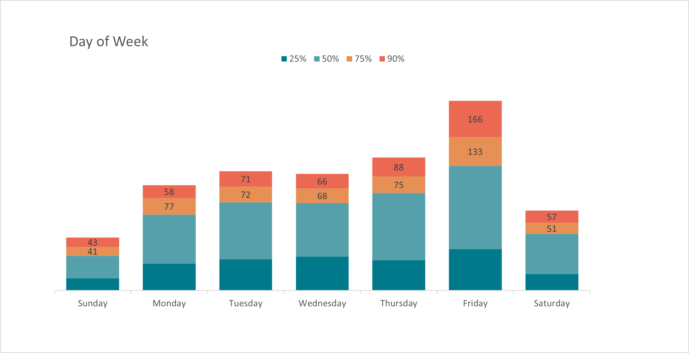
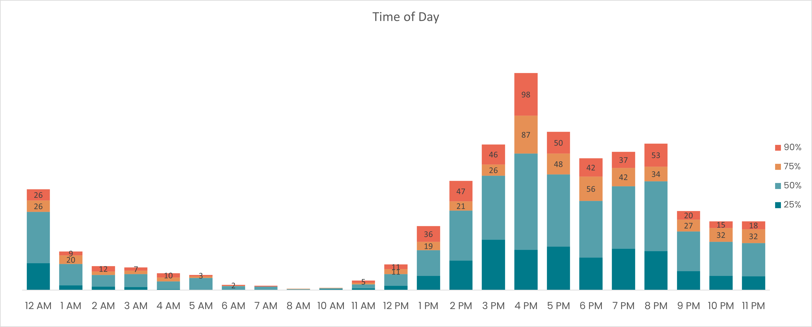

### Feel State Instagram Analysis

I encountered a client who needed help increasing the social media following for his small business. The goal was to provide the client some insight into their own Instagram page, as well as give some important key metrics into accounts with a larger followings and major competitors. To do this, I created a small python program to scrape data from Instagram accounts.  This program scraped time and date of post, likes a post received, caption, and hashtags. [Scraper](Scraper.py)

    

### Larger Accounts

After the raw data had been collected, I cleaned the data using [Excel](excel_cleaning.md). This included resolving issues such as removing duplicated rows, cleaning time/date stamps, and adding more columns for further analysis, such as Day of Week, Percentile, Caption word count, Hashtag count, and Account Name. From the [Jupyter Notebook](Social_Notebook.ipynb) included we have established the data for likes is very heavily skewed to the left. Another important thing to mention is that I have chosen to keep outliers in the data because although they are outliers, they still happen naturally. The data set in total is 2509 rows and 9 columns.

    
     

Using excel I calculated the 25%, 50%, 75% and 90% percentile to better understand the distrubition of the data. 

 
    
      

Percentiles identify where a score stands relative to other scores. For example, the 75th percentile of likes in our entire data set is 10,643 which means that 75% of our data falls below this individual value. Above are the values for the 25th, 50th, 75th and 90th percentile.
 
 
 

    
     

The image above displays the data grouped together by day of week and what percentage of posts were in each grouped percentile. Tuesday has the highest percentage of posts being over the 75% percentile mark, with 127 posts (30%) out of 422 posts total receiving more than 10,642 Likes.  In comparsion, Sunday has the worst performance with only 26 posts (14%) out of 86 posts total recieved over 10,642 Likes.  Sunday also has the highest percentage (39%) of post recieving less than 1,426 (25th Percentile).

 
 
 

    
      

This image groups our data according to time of day the post occured. The top chart displays the best performing hours of the day, with 12AM (Midnight) having the highest percentage (37%) of posts reaching the 75th percentile. 2PM has the lowest amount of posts reaching the 75th percentile with only 12% or 16 out of the 136 posts that occured at 2PM. 
 
 
*Some of the values were excluded from the tables of top performing because of the lack of data for those times. For example, 7AM and 6AM both only have two posts for those times. 

### Local Data
Now, we are looking at the data we scraped from our local area accounts. [Excel File](instagram_data/local.xlsx) After the data has been cleaned, the data consists of 3657 rows and 11 columns. 

    

    

In the image above, I utilized excel by creating two pivot tables. One shows how many posts reached each percentile and is grouped together by day of the week. The other chart shows the data grouped by time of day. Using those two pivot tables, I created the two charts below to give a visual representation of the data. 

    

The day of week chart tells us that on Friday 56% of posts recieve more than 178 (75th percentile) likes. And on Friday, 261 posts (30%) of the posts 872 that day recieve more than 316 likes (90th percentile). Sunday only had 17 posts. Only 7.8% of posts recieved more than 316 Likes. Friday, by comparison, performs significantly better. 

    

In the Local data, when grouped by time of day, the chart tells us that 4PM not only has the most amount of posts, but also has the highest percentage (35%) of posts reaching above 178 likes. 3PM has the highest percentage of posts under the 25th percentile mark with 116 post of 364 falling underneath that mark. 
 
 

Lastly, I created a dashboard using Google Data Studio. I chose this program because the client was already using google sheets for a portion of their inventory.  The dashboard displays the data by day of week as well as hour of day, including visualizations that represent the distribution of when the accounts were most active during the day. This dashboard also includes top hashtags and the posts with the greatest number of likes.  The first page of the dashboard shows how my clients' two store locations measured against other competitor social media pages on a daily, weekly, and yearly activity level. 
 

[Google Data Studio](https://datastudio.google.com/embed/reporting/35f68667-3262-4e0b-a0cc-a5ff28dcd253/page/qZC6C)

